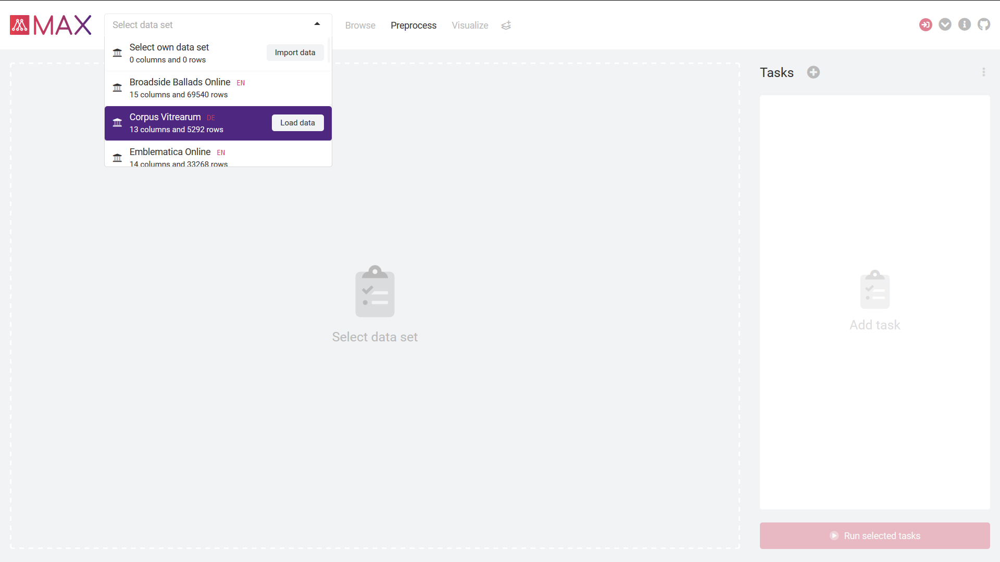
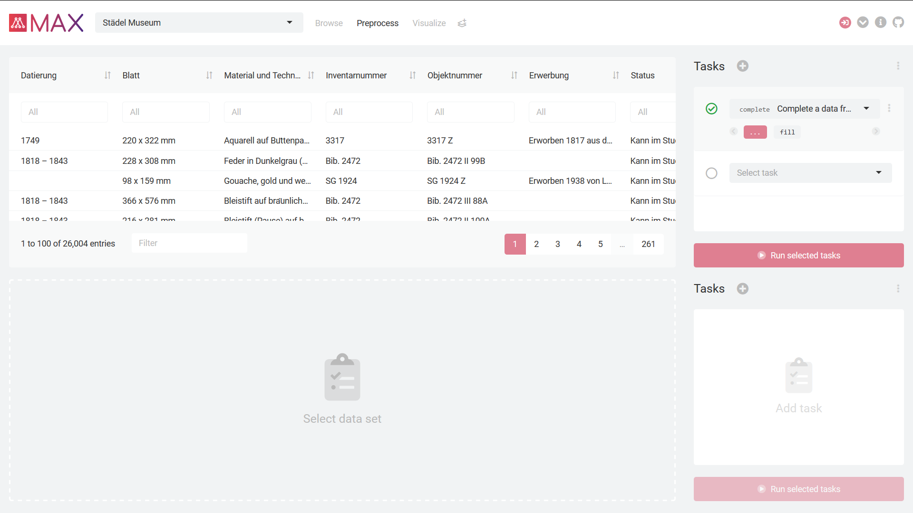

# *MAX* – Museum Analytics


## Overview

In recent years, large museum databases have been created in the international museum sector that are awaiting meaningful use. They offer a hitherto unknown opportunity for empirical investigation of the history of collections, which can be expected to yield far-reaching results, especially in a comparative perspective. *Museum Analytics*, *MAX*, is intended to enable lecturers to import freely selectable museum databases and make them available to students for analysis. The aim is to provide an interface that facilitates the introduction to programming with *R* through an intuitive visual feedback system.


## Usage

<p float="left">
	
	 
	
</p>

<p float="left">
	
	 
	
</p>

First, either load one of the predefined data sets or import your own (Screenshot *1*). Your currently selected data set is displayed on the left, either as a table or a plot (*2*). You can now preprocess and visualize this data, e.g., standardize dates or draw a boxplot. If you do not want to separate preprocessing and visualization, you can also do both in one window (*3*). On the right you can define tasks to be performed on your data set. First, either add a new task or import a file with tasks from a previous session. Each task can be further specified, e.g., you can temporarily disable it; or view the associated documentation (*4*). Finished? Let’s run the selected tasks to see if they can be completed successfully (*5*). If not, the respective task is marked yellow (a *warning* has occurred) or red (an *error* has occurred). The processed, cleansed, and visualized data can be exported as a `.zip` file (*6*).


## Data

Initially, 17 institutions with almost 500,000 objects were selected as museum collections to be integrated into the tool: e.g., the [National Gallery of Art](https://www.nga.gov/) and the [Städel Museum](https://www.staedelmuseum.de/) in Frankfurt. These were extracted by means of *web scraping*. Since all selected collections are annotated with the iconographic classification system [Iconclass](http://iconclass.org/), they can be meaningfully examined in humanities seminar contexts.


## Functionalities

* A graphical user interface that enables fast progress without excessive training. Each task can be further specified, e.g., can be temporarily disabled. The order of the tasks can be changed with *drag & drop*.
* An import module to “pull” existing data, e.g., from the [Rijksmuseum](https://www.rijksmuseum.nl/) in Amsterdam or [Österreichische Galerie Belvedere](https://www.belvedere.at/), into the tool as easily as possible. Own data sets can be fed in just as easily. Currently supported are `.rds`, `.txt`, `.csv`, `.json`, `.xls`, and `.xlsx` files.
* An export module to extract the processed, cleansed, and visualized data as a `.zip` file with *R*-compatible `.rds` files. Reproducible *R* code can also be generated based on the defined tasks.
* Interactive tables with *DataTables* that allow to select rows by setting local and global filters. A flexbox layout is used to display the relevant section of the table always next to the tasks to be performed.
* Dynamic and interactive graphics with *Plotly* that show more details on mouseover, e.g., the title or artist of an artwork. They enrich the statistical analysis by displaying complex relationships in an attractive way. Plot subregions can be selected and zoomed in.


## Extensions

If you want to extend the functionality of *MAX*, you can add an *R* package function to the `.yaml` file in the folder `data` that corresponds to the respective section, i.e., currently either `preprocess-history.yaml` or `visualize-history.yaml`. The function to be added must be *Pipe*-friendly or *ggplot*-compatible.


## Deployment

The web application is deployed through RStudio’s [shinyapps.io](https://sschneider.shinyapps.io/museum-analytics/). Additionally, it is published on [RStudio Cloud](https://rstudio.cloud/project/1077562), which provides a complete development environment of the project. To promote collaboration and guarantee reproducibility, a list of all required *R* package dependencies (and their versions) was generated with *packrat*.


## About the Project

*MAX* was funded from 1 March to 30 November 2018 within the program *Lehre@LMU* to strengthen research orientation in teaching. It is a project of the *IT-Gruppe Geisteswissenschaften*, the Institute of Statistics and the Institute of Art History at *Ludwig-Maximilians-Universität München*. Our team consists of Severin Burg, B.A., [Prof. Dr. Hubertus Kohle](https://www.kunstgeschichte.uni-muenchen.de/personen/professoren_innen/kohle/index.html), [Prof. Dr. Helmut Küchenhoff](https://www.stablab.stat.uni-muenchen.de/personen/leitung/kuechenhoff1/index.html) and [Stefanie Schneider, M.Sc.](https://www.kunstgeschichte.uni-muenchen.de/personen/wiss_ma/schneider/index.html)

The web application is written using *R* and the *Shiny* web framework. It is open source and licensed under *GNU General Public License v3.0*. This version is a complete re-implementation that makes use of *Shiny* modules and custom HTML templates. For the previous version, please see: https://dhvlab.gwi.uni-muenchen.de/max/.


## Citation

To cite *MAX* in publications use: Schneider, Stefanie; Kohle, Hubertus; Burg, Severin; Küchenhoff, Helmut (2020): Museum Analytics. An Online Tool for the Comparative Analysis of Museum Databases, Version 0.2.0, https://github.com/stefanieschneider/MAX.

A *BibTeX* entry for *LaTeX* users is:

```
@Manual{,
	title = {Museum Analytics. An Online Tool for the Comparative Analysis of Museum Databases},
	author = {Stefanie Schneider and Hubertus Kohle and Severin Burg and Helmut Küchenhoff},
	year = {2020},
	note = {Version 0.2.0},
	url = {https://github.com/stefanieschneider/MAX},
}
```


## References

* Schneider, Stefanie (2020): “Museum Analytics. Museale Sammlungen neu und anders entdecken”. In: Museumskunde 85 (*upcoming*).
* Schneider, Stefanie; Kohle, Hubertus; Burg, Severin; Küchenhoff, Helmut (2019): “Museum Analytics. Ein Online-Tool zur vergleichenden Analyse musealer Datenbestände”. Postersession bei der DHd 2019. Digital Humanities: multimedial & multimodal, DOI: https://doi.org/10.5281/zenodo.2612834.
* Schneider, Stefanie; Kohle, Hubertus; Burg, Severin; Küchenhoff, Helmut (2019): “Museum Analytics. Ein Online-Tool zur vergleichenden Analyse musealer Datenbestände”. In: DHd 2019. Digital Humanities: multimedial & multimodal. Konferenzabstracts, S. 334–335, DOI: https://doi.org/10.5281/zenodo.2596095.


## Contributing

Please report issues, feature requests, and questions to the [GitHub issue tracker](https://github.com/stefanieschneider/MAX/issues). We have a [Contributor Code of Conduct](https://github.com/stefanieschneider/MAX/blob/master/CODE_OF_CONDUCT.md). By participating in *MAX* you agree to abide by its terms.
