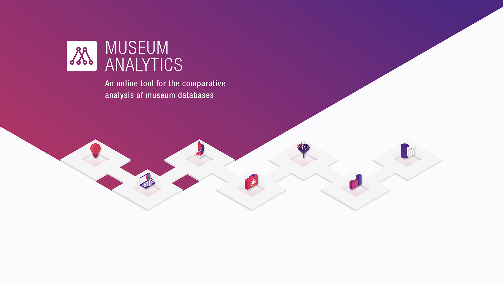

# MAX – Museum Analytics

## About the Project

In recent years, large museum databases have been created in the international museum sector that are awaiting meaningful use. They offer a hitherto unknown opportunity for empirical investigation of the history of collections, which can be expected to yield far-reaching results, especially in a comparative perspective. *Museum Analytics*, *MAX*, is intended to enable lecturers to import freely selectable museum databases and make them available to students for analysis.

*MAX* was funded from 1 March to 30 November 2018 within the program *Lehre@LMU* to strengthen research orientation in teaching. It is a project of the *IT-Gruppe Geisteswissenschaften*, the Institute of Statistics and the Institute of Art History at *Ludwig-Maximilians-Universität München*. Our team consists of Severin Burg, B.A., Prof. Dr. Hubertus Kohle, Prof. Dr. Helmut Küchenhoff and Stefanie Schneider, M.Sc.

The web application is written using *R* and the *Shiny* web framework. It is open source and licensed under *GNU General Public License v3.0*. This version is a complete re-implementation that makes use of *Shiny* modules and custom HTML templates.
